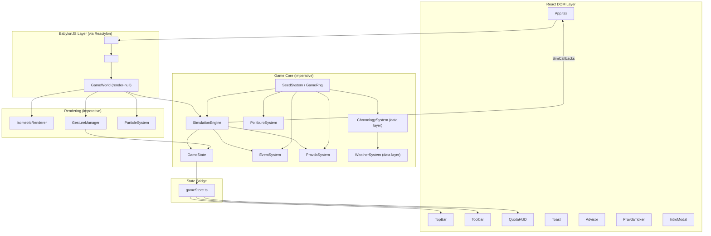

# System Patterns — SimSoviet 2000

## High-Level Architecture



## Key Architectural Decisions

### 1. Two-Layer Rendering (BabylonJS + React DOM)
The game viewport is a BabylonJS canvas managed by Reactylon. All 2D UI (toolbar, stats, notifications) renders as React DOM elements positioned absolutely over the canvas. This separates 3D game rendering from UI concerns and avoids BabylonJS GUI performance costs.

### 2. Render-Null GameWorld Component
`GameWorld.tsx` sits inside Reactylon's `<Scene>` but returns `null` — it exists purely to access `useScene()` and `useCanvas()` hooks, then imperatively creates the renderer, gesture manager, and simulation engine. This is the bridge between React's lifecycle and BabylonJS's imperative API.

### 3. Mutable State + Immutable Snapshots
`GameState` is a mutable class mutated directly by `SimulationEngine.tick()` and `GestureManager`. The `gameStore.ts` module wraps it with `useSyncExternalStore` — calling `notifyStateChange()` creates a frozen `GameSnapshot` and triggers React re-renders. This avoids the overhead of immutable updates on every game tick while keeping React's rendering model intact.

**Critical**: Any code that mutates `GameState` MUST call `notifyStateChange()` afterward or React components won't update.

### 4. SimCallbacks Pattern
`SimulationEngine` doesn't know about React. Instead, `App.tsx` passes a `SimCallbacks` object with `onToast`, `onAdvisor`, `onPravda`, and `onStateChange` callbacks. This decouples the simulation from the UI framework.

### 5. Gesture State Machine
`GestureManager` uses a three-state machine (`idle → pending → panning`) to distinguish taps from camera pans on touch devices. Only confirmed taps (< 250ms, < 12px movement) trigger `scene.pick()` for building placement.

### 6. ECS with Miniplex
The ECS layer uses Miniplex 2's single-interface pattern where all components are optional properties on `Entity`. Archetypes in `archetypes.ts` provide pre-built queries. **Predicate-based archetypes** (e.g., `poweredBuildings`) require `world.reindex(entity)` after mutating the predicate field.

Note: The ECS and the imperative `GameState` class coexist. The ECS is newer and not yet fully integrated.

### 7. Seeded Randomness (NEW)
All game randomness flows through `GameRng`, a wrapper around the `seedrandom` library. The seed is a Soviet-themed phrase ("frozen-dialectical-turnip") stored in `GameState.seed`.

**Module-level `_rng` pattern**: Systems with many generator functions (PravdaSystem has 61) use a module-scoped `let _rng: GameRng | null = null` variable set by the class constructor. This avoids threading RNG through every function parameter while still achieving deterministic randomness.

```typescript
// Pattern used in PravdaSystem, EventSystem, PolitburoSystem, NameGenerator, WorldBuilding
let _rng: GameRng | null = null;
function pick<T>(arr: readonly T[]): T {
  return _rng ? _rng.pick(arr) : arr[Math.floor(Math.random() * arr.length)]!;
}
class PravdaSystem {
  constructor(gs: GameState, rng?: GameRng) {
    if (rng) _rng = rng;
  }
}
```

### 8. Chronology System (NEW — data layer only)
Time model: 1 tick = 1s real, 3 ticks = 1 day (8h per tick), 10 days = 1 month (Soviet dekada), 12 months = 1 year → 360 ticks ≈ 6 real minutes per game year.

Three files form the data layer:
- `Chronology.ts` — GameDate interface, Season enum, 7 season profiles with farm/build/heat/snow modifiers, day/night phase calculation
- `WeatherSystem.ts` — 9 weather types with gameplay profiles, per-season probability tables, weather roll function
- `ChronologySystem.ts` — Stateful tick advancement, season transitions, weather expiry/re-roll, serialize/deserialize for save/load

**Not yet integrated** into SimulationEngine (Phase 3 pending).

### 9. Event System
`EventSystem` selects from 50+ event templates using weighted random selection with conditions, cooldowns (25s wall-clock — will switch to tick-based), and deduplication (last 10 events). Templates can have dynamic text via functions over `GameState`. `PravdaSystem` generates propagandistic headlines from events.

## Design Patterns

| Pattern | Where | Purpose |
|---------|-------|---------|
| Singleton | `world` (Miniplex), `gameStore` | Single source of truth |
| Observer | `useSyncExternalStore` in gameStore | React reactivity bridge |
| State Machine | GestureManager | Input disambiguation |
| Template Method | EventSystem templates | Dynamic event generation |
| Strategy | AudioManager categories | Volume by audio type |
| Facade | SimulationEngine | Orchestrates all per-tick systems |
| Module-level state | `_rng` in generators | Seeded RNG without parameter threading |
| Wrapper/Adapter | GameRng over seedrandom | Typed convenience methods |

## Component Relationships

### UI Components (src/components/ui/)
All are pure React components. They read state via `useGameSnapshot()` or receive props from `App.tsx`. `Toolbar` calls `selectTool()` to change the active building tool.

### Rendering (src/rendering/)
- `IsometricRenderer` — creates/manages BabylonJS meshes for the grid and buildings, provides `worldToGrid()` conversion and highlight mesh
- `ParticleSystem` — BabylonJS particle system for perpetual snow effect

### Audio (src/audio/)
- `AudioManager` — orchestrates music playback (HTMLAudioElement) and SFX (Tone.js procedural)
- `AudioManifest` — declares all 40+ tracks with mood tags for context-sensitive music selection
- `ProceduralSounds` — Tone.js synthesizer for build/destroy/notification/coin SFX
