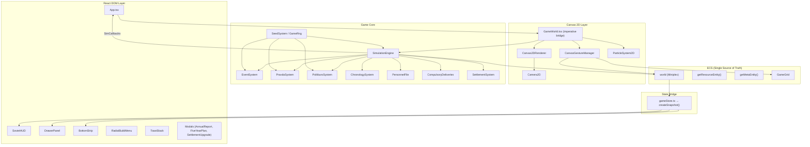

# System Patterns — SimSoviet 2000

## High-Level Architecture



## Key Architectural Decisions

### 1. Two-Layer Rendering (Canvas 2D + React DOM)
The game viewport is a Canvas 2D element rendering pre-baked isometric sprites. All UI (HUD, menus, modals, notifications) renders as React DOM elements positioned absolutely over the canvas. This separates sprite rendering from UI concerns.

### 2. GameWorld as Imperative Bridge
`GameWorld.tsx` is a React component that returns `null` — it exists purely to bridge React's lifecycle with the imperative game loop. It creates the `Canvas2DRenderer`, `CanvasGestureManager`, `ParticleSystem2D`, and `SimulationEngine` in a `useEffect`, storing callbacks in a `useRef` to prevent re-render thrashing.

### 3. ECS as Single Source of Truth (GameState DELETED)
The ECS world is the sole authority for all game state. The old `GameState` class has been completely deleted. All systems read/write ECS directly:
- **Resources**: `getResourceEntity()!.resources.*` (money, food, vodka, power, population)
- **Metadata**: `getMetaEntity()!.gameMeta.*` (date, quota, leader, settlement, personnel, gameOver)
- **Buildings**: `buildingsLogic.entities` archetype query
- **Grid**: `GameGrid` class (spatial occupancy index only)
- **React bridge**: `gameStore.ts` creates immutable snapshots from ECS via `useSyncExternalStore`

**Critical**: Any code that mutates ECS MUST call `notifyStateChange()` afterward or React components won't update.

### 4. SimCallbacks Pattern
`SimulationEngine` doesn't know about React. Instead, `App.tsx` passes a `SimCallbacks` object with `onToast`, `onAdvisor`, `onPravda`, and `onStateChange` callbacks. This decouples the simulation from the UI framework.

### 5. Gesture State Machine
`CanvasGestureManager` uses a three-state machine (`idle -> pending -> panning`) to distinguish taps from camera pans on touch devices. Only confirmed taps trigger building placement via the radial pie menu.

### 6. ECS with Miniplex
The ECS layer uses Miniplex 2's single-interface pattern where all components are optional properties on `Entity`. Archetypes in `archetypes.ts` provide pre-built queries. **Predicate-based archetypes** (e.g., `poweredBuildings`) require `world.reindex(entity)` after mutating the predicate field.

### 7. Seeded Randomness
All game randomness flows through `GameRng`, a wrapper around the `seedrandom` library. The seed is stored in the `GameMeta` ECS component.

**Module-level `_rng` pattern**: Systems with many generator functions (PravdaSystem has 61) use a module-scoped `let _rng: GameRng | null = null` variable set by the class constructor. This avoids threading RNG through every function parameter while still achieving deterministic randomness.

```typescript
// Pattern used in PravdaSystem, EventSystem, PolitburoSystem, NameGenerator, WorldBuilding
let _rng: GameRng | null = null;
function pick<T>(arr: readonly T[]): T {
  return _rng ? _rng.pick(arr) : arr[Math.floor(Math.random() * arr.length)]!;
}
class PravdaSystem {
  constructor(rng?: GameRng) {
    if (rng) _rng = rng;
  }
}
```

### 8. Chronology System (INTEGRATED)
Time model: 1 tick = 1s real, 3 ticks = 1 day (8h per tick), 10 days = 1 month (Soviet dekada), 12 months = 1 year -> 360 ticks ~ 6 real minutes per game year.

Three files form the data layer:
- `Chronology.ts` — GameDate interface, Season enum, 7 season profiles with farm/build/heat/snow modifiers
- `WeatherSystem.ts` — 9 weather types with gameplay profiles, per-season probability tables
- `ChronologySystem.ts` — Stateful tick advancement, season transitions, weather expiry/re-roll

### 9. Event System
`EventSystem` selects from 50+ event templates using weighted random selection with conditions, cooldowns, and deduplication (last 10 events). Templates can have dynamic text via functions over `GameView` (read-only ECS snapshot). `PravdaSystem` generates propagandistic headlines from events.

### 10. GameView for Lambda Conditions
`GameView` is a read-only snapshot built each tick from ECS data. It provides the same field names as the old `GameState` for backward compatibility with event template and Pravda headline lambda conditions (`createGameView()` in `src/game/GameView.ts`).

## Design Patterns

| Pattern | Where | Purpose |
|---------|-------|---------|
| Singleton | `world` (Miniplex), `gameStore` | Single source of truth |
| Observer | `useSyncExternalStore` in gameStore | React reactivity bridge |
| State Machine | CanvasGestureManager | Input disambiguation |
| Template Method | EventSystem templates | Dynamic event generation |
| Strategy | AudioManager categories | Volume by audio type |
| Facade | SimulationEngine | Orchestrates all 13 per-tick systems |
| Module-level state | `_rng` in generators | Seeded RNG without parameter threading |
| Wrapper/Adapter | GameRng over seedrandom | Typed convenience methods |
| callbacksRef | GameWorld.tsx | Prevent useEffect re-render thrashing |

## Component Relationships

### UI Components (src/components/ui/)
All are pure React components. They read state via `useGameSnapshot()` or receive props from `App.tsx`. The radial build menu (SVG pie) replaces the old toolbar for building placement.

### Rendering (src/rendering/)
- `Canvas2DRenderer` — 6-layer renderer (ground, grid, buildings, hover, preview, particles)
- `Camera2D` — pan/zoom with DPR-aware canvas sizing
- `GridMath` — isometric grid-to-screen projection (TILE_WIDTH=80, TILE_HEIGHT=40)
- `SpriteLoader` — manifest-driven sprite loading, 31 building PNGs
- `ParticleSystem2D` — snow/rain in screen-space

### Audio (src/audio/)
- `AudioManager` — orchestrates music playback (HTMLAudioElement) and SFX (Tone.js procedural)
- `AudioManifest` — declares all 40+ tracks with mood tags for context-sensitive music selection
- `ProceduralSounds` — Tone.js synthesizer for build/destroy/notification/coin SFX
